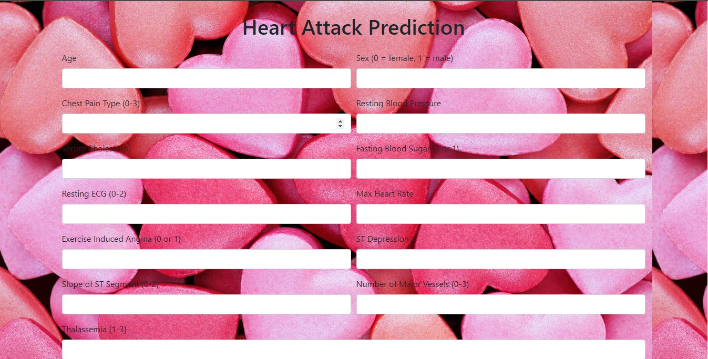

# Heart Attack Prediction Web App

Welcome to the Heart Attack Prediction Web App! This application helps predict the likelihood of a heart attack based on various health parameters.

## Features
- User-friendly interface
- Input parameters such as age, gender, blood pressure, cholesterol levels, etc.
- Prediction results based on machine learning algorithms
- Visual representation of risk factors

## Installation
To run this web app locally, follow these steps:
1. Clone the repository: `git clone https://github.com/AdityaSrivastavDS/Heart-ATtack-Prediction-Web_App`
2. Navigate to the project directory: `cd Heart-Attack-Prediction-Web_App`
3. Run the application: `python app.py`

## Usage
Once the application is running, enter the required health parameters into the form and click on the "Predict" button. The application will display the likelihood of a heart attack based on the provided inputs.

## Contributing
Contributions are welcome! Please fork the repository and submit a pull request with your changes.

## License
This project is licensed under the MIT License. See the [LICENSE](LICENSE) file for details.

## Hosted On(live view):
https://heart-attack-risk-predictor-web-app.onrender.com/

## Contact
If you have any questions or suggestions, feel free to open an issue or contact me at [adityasrivastav729@gmail.com](mailto:adityasrivastav729@gmail.com).
