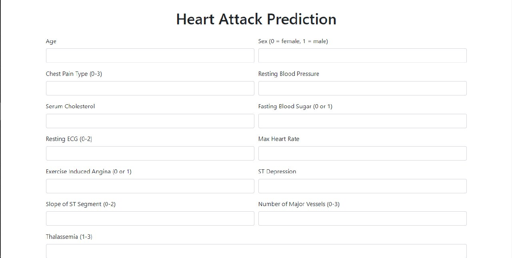

<!DOCTYPE html>
<html lang="en">
<head>
    <meta charset="UTF-8">
    <meta name="viewport" content="width=device-width, initial-scale=1.0">
</head>
<body>
    <h1>Heart Attack Prediction Web App</h1>
     
    
    
    
Welcome to the Heart Attack Prediction Web App! This application helps predict the likelihood of a heart attack based on various health parameters.

    
    <h2>Features</h2>
    <ul>
        <li>User-friendly interface</li>
        <li>Input parameters such as age, gender, blood pressure, cholesterol levels, etc.</li>
        <li>Prediction results based on machine learning algorithms</li>
        <li>Visual representation of risk factors</li>
    </ul>

    <h2>Installation</h2>
    
To run this web app locally, follow these steps:

    <ol>
        <li>Clone the repository: <code>git clone https://github.com/AdityaSrivastavDS/Heart-ATtack-Prediction-Web_App</code></li>
        <li>Navigate to the project directory: <code>cd heart-attack-prediction</code></li>
        <li>Run the application: <code>python app.py</code></li>
    </ol>

    <h2>Usage</h2>
    
Once the application is running, enter the required health parameters into the form and click on the "Predict" button. The application will display the likelihood of a heart attack based on the provided inputs.

    <h2>Contributing</h2>
    
Contributions are welcome! Please fork the repository and submit a pull request with your changes.

    <h2>License</h2>
    
This project is licensed under the MIT License. See the <a href="LICENSE">LICENSE</a> file for details.

    <h2>Contact</h2>
    
If you have any questions or suggestions, feel free to open an issue or contact me at <a href="mailto:your-email@example.com">your-email@example.com</a>.

</body>
</html>
